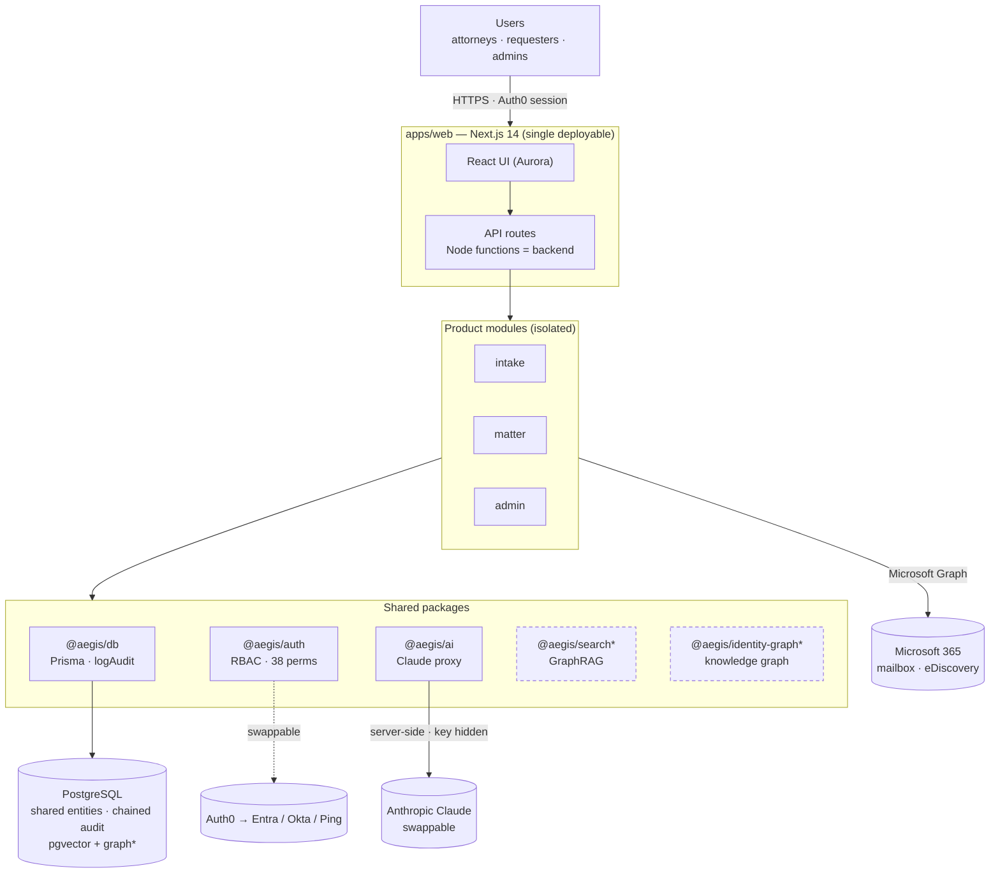
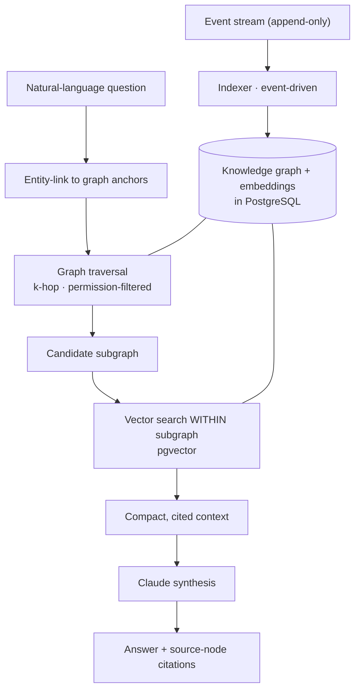

# AEGIS — Architecture Diagrams

Renderable Mermaid (GitHub renders these inline). `*` = designed / next
build phase; everything else is built today.

## 1. System architecture



**Key points to say over it:** one deployable app; the "backend" is the
Next.js API layer; **one PostgreSQL** holds shared entities + the audit
chain (+ vectors/graph later); Auth, AI, and email are external and
**swappable** behind package boundaries.

## 2. Intake request flow (all three channels → one governed pipeline)

```mermaid
flowchart LR
  F["Web form"] --> ING
  E["Email<br/>webhook + M365 poll"] --> ING
  D["Document upload<br/>.docx · .txt · .pdf"] --> ING
  ING["Ingest<br/>classify + route"] --> AG["Agent · 1 of 6<br/>Claude + real-data lookups"]
  AG --> REC["PENDING recommendation<br/>+ AgentDecision"]
  REC --> H{"Human<br/>approves?"}
  H -->|yes| ACT["Send reply / spawn Matter"]
  H -->|no| RJ["Rejected"]
  ING -. "every step" .-> AUD[("Chained AuditLog")]
  AG -. .-> AUD
  ACT -. .-> AUD
```

**Key points:** three channels, one pipeline; a deterministic router picks
one specialist agent; **nothing acts without human approval**; every step
is on the tamper-evident audit chain.

## 3. The Brain — knowledge graph + GraphRAG



**Key points:** the graph is **authored** by the modules (not extracted
from documents) → cheaper + accurate; graph traversal **pre-filters**
before vector search → small, connected, **cited** context → faster and
cheaper than plain vector RAG; graph + vectors + records all in **one
Postgres, in your region**.
